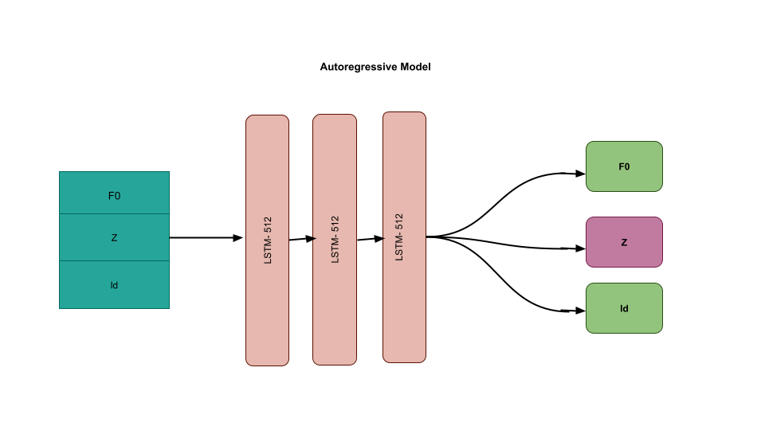

# RNN-based-models

This is an Autoregressive Model trained on a latent space of a Vector-Quantized (VQ) [DDSP](https://magenta.tensorflow.org/ddsp). The DDSP was trained on Audio data. 
The goal of training this model is to generate latent sequences of desired length to use them further to generate Audio. 
The model architechture is given below:

In the [utils.py](https://github.com/ratulKabir/RNN-seq-based-models/blob/main/utils/util_funcs.py) file you can find the helper functions. sample_test() and generate_rnn() are the two functions that sample from the trained LSTM mdoel.
